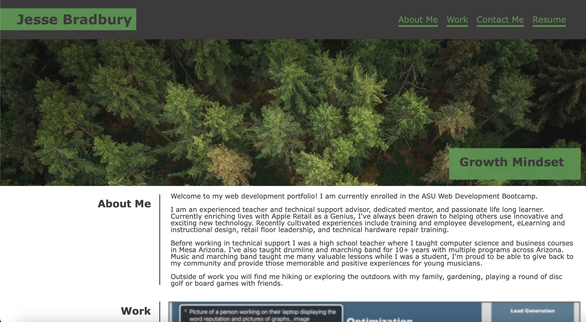

# Portfolio
Jesse Bradbury professional web development protforlio website.

## Description
I created this website from scratch to showcase and display some of the projects I have completed through the ASU Web Development Bootcamp. 

## Screenshot

## Link
[Click here to view my project!](https://jessebradbury.github.io/Marketing-Project/)

## Credits
I worked with my classmate Michael Cosand to figure out the flex boxes and header text. 

The 4 placeholder images in my works section were found online and are cited here. 

PassGen Photo: https://www.makelovelocks.com/archives/a-lot-of-locks-of-love-lock-locks-lovelocks-lovelockbridge/

LED Wall Photo: Image by upklyak - https://www.freepik.com/free-vector/led-video-wall-screen-texture-background-display_9292907.htm#query=led%20wall&position=8&from_view=search&track=ais 

Weather App: A rainy night in Tokyo (by Masashi Wakui) - https://imgur.com/Fz88F7w 

Score Board: Photo of Next Level Pinball Museum - Article by Samantha Swindler - https://www.oregonlive.com/living/2023/03/this-oregon-arcade-has-been-named-worlds-best-place-for-pinball.html
